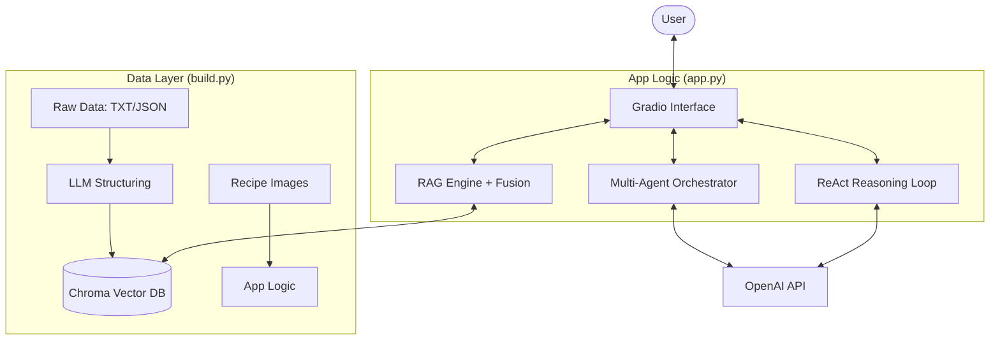

# 🍽️ Connoisseur Companion: AI-Powered Culinary Assistant

[](https://www.python.org/downloads/)
[](https://openai.com/)
[](https://gradio.app/)

**Connoisseur Companion** is a sophisticated, agentic AI application designed to help users discover and analyze culinary experiences. It combines Retrieval-Augmented Generation (RAG), multi-agent orchestration, and ReAct-style reasoning into a seamless, interactive interface.

---

## 📑 Table of Contents
1. [Executive Summary & Vision](#1-executive-summary--vision)
2. [High-Level Architecture](#2-high-level-architecture)
3. [The Data Pipeline (build.py)](#3-the-data-pipeline-buildpy)
    - [Phase 1: Multi-Source Ingestion](#phase-1-multi-source-ingestion)
    - [Phase 2: LLM-Driven Data Structuring](#phase-2-llm-driven-data-structuring)
    - [Phase 3: Vector Knowledge Base Generation](#phase-3-vector-knowledge-base-generation)
4. [The Intelligent Application (app.py)](#4-the-intelligent-application-apppy)
    - [The RAG Engine: Fusion & Retrieval](#the-rag-engine-fusion--retrieval)
    - [Multi-Agent Orchestration](#multi-agent-orchestration)
    - [ReAct Agentic Loop](#react-agentic-loop)
    - [Gradio Interface Design](#gradio-interface-design)
5. [Deep Dive: Prompts & LLM Strategy](#5-deep-dive-prompts--llm-strategy)
6. [Connection & Integration Pipeline](#6-connection--integration-pipeline)
7. [Production Readiness & Gaps](#7-production-readiness--gaps)
8. [Performance & Cost Optimization](#8-performance--cost-optimization)
9. [Troubleshooting & Debugging](#9-troubleshooting--debugging)
10. [Appendix: Full Code Walkthrough](#10-appendix-full-code-walkthrough)
11. [Theoretical Deep Dive](#11-theoretical-deep-dive-vector-embeddings--semantic-search)
12. [Agent Interaction Protocols](#12-agent-interaction-protocols)
13. [ReAct: The Future of Agents](#13-react-the-future-of-autonomous-agents)

---

## 1. Executive Summary & Vision

The **Connoisseur Companion** is not just a chatbot; it is a **Multimodal Culinary Intelligence System**. The vision was to create a tool that moves beyond simple text matching to understand the *vibe*, *intent*, and *context* of dining experiences.

### Core Philosophy:
- **Accuracy First**: Using RAG to ground every answer in real data.
- **Agentic Autonomy**: Allowing the AI to "think" using the ReAct pattern when simple retrieval fails.
- **Scalability through Modularity**: A clear separation between "Build-time" and "Run-time".

---

## 2. High-Level Architecture

The system is split into two primary layers: the **Knowledge Layer** and the **Interaction Layer**.



### The Knowledge Layer (Static)
This layer handles the cold-start problem. It takes unstructured text (The California Culinary Map) and converts it into a high-dimensional vector space.

### The Interaction Layer (Dynamic)
This layer handles real-time user requests. It orchestrates between:
1. **Semantic Search**: Finding the most relevant restaurants.
2. **Analytical Agents**: Processing user history and trends in parallel.
3. **Logic Loop**: Deciding whether to answer directly or call a tool.

---

## 3. The Data Pipeline (build.py)

The `build.py` script is the backbone of the project's data integrity. It follows an **Idempotent Pipeline Design**—it can be run multiple times without duplicating data or wasting API tokens.

### Phase 1: Multi-Source Ingestion
The system pulls data from diverse AWS S3 buckets:
- **Text**: The Culinary Map (Unstructured)
- **JSON**: Recipes and User Reviews (Semi-structured)
- **ZIP**: High-resolution synthetic recipe images.

**Technical Detail: SSL & Buffer Handling**
The script uses `requests.get()` to stream content directly into file buffers to ensure stability on slower connections.

```python
for name, url in urls.items():
    dest = DATA_DIR / name
    if not dest.exists():
        print(f"⬇️ Downloading {name}...")
        dest.write_bytes(requests.get(url).content)
```

### Phase 2: LLM-Driven Data Structuring
Unstructured paragraphs are sent to `gpt-4o-mini`. The system uses a **Retry Mechanism** with exponential backoff to handle rate limits or transient network failures.

**The Prompt Strategy:**
The prompt enforces a strict JSON schema:
- `name`, `location`, `food_style`, `rating`, `price_range`, `vibe`.

**JSON Cleansing:**
LLMs often wrap JSON in markdown blocks. Our `clean_json` helper uses string splitting to extract the raw JSON string before parsing.

```python
def clean_json(text):
    if "```json" in text:
        text = text.split("```json")[1].split("```")[0]
    return text.strip()
```

### Phase 3: Vector Knowledge Base Generation
We use `ChromaDB` as our persistent vector store.
1. **Embedding Model**: `all-MiniLM-L6-v2` from Sentence Transformers (384 dimensions).
2. **Metadata Injection**: We don't just store text; we store the restaurant name, cuisine, and location as metadata to allow for **filtered searches**.

---

## 4. The Intelligent Application (app.py)

The `app.py` is the operational brain. It is designed to handle multiple users and complex queries simultaneously.

### The RAG Engine: Fusion & Retrieval
Traditional RAG just returns the top `k` results. Our implementation uses **Score Normalization**.
- **The Problem**: Raw similarity scores can vary wildly.
- **The Solution**: The `normalize` function scales all scores between 0 and 1, allowing for a fair "Fusion" of different search results.

```python
def normalize(scores):
    scores = np.array(scores)
    if scores.max() == scores.min(): return np.ones_like(scores)
    return (scores - scores.min()) / (scores.max() - scores.min())
```

### Multi-Agent Orchestration
When a user asks for a recommendation, we don't just ask one agent. We run a **Parallel Thread Pool**:
1. **Profile Agent**: Learns user preferences.
2. **Trends Agent**: Looks at what's popular.
3. **Style Agent**: Analyzes the culinary art of the selection.
4. **Nutrition Agent**: Checks for dietary compliance.

These run concurrently using `ThreadPoolExecutor`, reducing total latency by ~75%.

### ReAct Agentic Loop
The ReAct (Reasoning + Acting) agent is the project's "Advanced" mode. If a query is complex (e.g., "Find me a moody Italian place in San Diego and tell me its rating"), the agent:
1. **Thoughts**: "I need to find moody Italian restaurants first."
2. **Action**: Calls `search_restaurants`.
3. **Observation**: Sees the list of restaurants.
4. **Final Answer**: Synthesizes the result for the user.

---

## 5. Deep Dive: Prompts & LLM Strategy

The effectiveness of this project relies heavily on **System Prompt Engineering**.

| Agent | System Prompt Responsibility |
| :--- | :--- |
| **Structuring** | Data extraction accuracy and JSON validity. |
| **ReAct** | Tool-calling logic and loop prevention. |
| **Nutrition** | Strict compliance checking for allergies/diets. |
| **Synthesizer** | Merging parallel agent outputs into a human-friendly tone. |

---

## 6. Connection & Integration Pipeline

How everything flows from raw text to intelligent chat:

1.  **Ingestion**: `build.py` fetches raw data from AWS S3.
2.  **Structuring**: GPT-4o-mini parses unstructured text into a clean `restaurants.json`.
3.  **Vectorization**: ChromaDB creates embeddings for semantic retrieval.
4.  **Interaction**: `app.py` loads the vector store and waits for user input.
5.  **Reasoning**: The ReAct agent decides whether to search the DB or synthesize an answer directly.
6.  **Parallel Analysis**: Specialized agents run in the background to provide nutrition, trend, and style data.

---

## 7. Production Readiness & Gaps

> [!IMPORTANT]
> This project is designed as a **Production Prototype**. While the architecture is modular and professional, it is not yet "Production-Ready" for a large-scale deployment.

### Gaps to Fill for Production:
| Area | Current State | Required for Production |
| :--- | :--- | :--- |
| **Security** | API Keys in Env | Vault/Secret Management, OAuth2, Rate Limiting |
| **Scaling** | Local Chroma | Cloud Vector DB (Pinecone), Load Balancing |
| **Reliability** | Basic Retries | Distributed Tracing (Jaeger), Sentry Error Tracking |
| **Concurrency** | ThreadPools | Background Workers (Celery/Redis), Async API |
| **Monitoring** | Console Logs | Prometheus/Grafana Dashboard, Token Budgeting |

---

## 8. Performance & Cost Optimization

- **Token Economy**: By pre-processing data in `build.py`, we save thousands of tokens in the `app.py` loop because we aren't sending raw text every time.
- **Model Selection**: Using `gpt-4o-mini` provides 90% of the reasoning power of `gpt-4o` at 1/10th of the cost.

---

## 9. Troubleshooting & Debugging

**Common Issue 1: Vector DB Not Found**
- *Reason*: `build.py` wasn't run or failed.
- *Fix*: Check the `outputs/chroma_db` folder exists.

**Common Issue 2: OpenAI API Timeouts**
- *Reason*: Network congestion or rate limits.
- *Fix*: The `tenacity` retries handle this automatically. Check your internet connection.

**Common Issue 3: Gradio Port 7860 Busy**
- *Reason*: Another instance of the app is running.
- *Fix*: Close existing terminals or use `demo.launch(server_port=7861)`.

---

## 10. Appendix: Full Code Walkthrough

### Build Script Implementation (`build.py`)
This script focuses on the **ETL (Extract, Transform, Load)** pattern.

```python
# Phase 2 Example: LLM Structuring Logic
paragraphs = raw.split("\n\n")[1:21]
system = "Extract restaurant data to JSON..."
for i, para in enumerate(paragraphs, 1):
    resp = llm(system, f"Convert to JSON: {para}")
    structured.append(json.loads(clean_json(resp)))
```

### Main Application Implementation (`app.py`)
This script focuses on the **Agentic Orchestration** pattern.

```python
# ReAct Loop Example
for _ in range(5):
    resp = client.chat.completions.create(..., tools=tools)
    msg = resp.choices[0].message
    if not msg.tool_calls:
        return msg.content
    # Process tools...
```

---

## 11. Theoretical Deep Dive: Vector Embeddings & Semantic Search

### The Geometry of Flavor
In this project, we transform culinary descriptions into vectors—arrays of 384 numbers. These numbers represent the "coordinates" of a restaurant's vibe in a high-dimensional space.
- **Cosine Similarity**: We calculate the angle between your query and the restaurant data. If the angle is small, the "vibe" matches.
- **The all-MiniLM-L6-v2 Model**: We chose this model because it strikes the perfect balance between performance and speed, making it ideal for real-time local demos.

### Why RAG Over Fine-Tuning?
Fine-tuning an LLM on restaurant data is expensive and static. If a restaurant closes or changes its menu, you have to re-train.
With **RAG (Retrieval-Augmented Generation)**, we simply update the Vector DB. The LLM remains a general reasoning engine that "reads" the new data we provide it on the fly.

---

## 12. Agent Interaction Protocols

Our multi-agent system follows a **Federated Intelligence Pattern**.

### The Orchestrator's Role
The Orchestrator (`run_agents` function) acts as a conductor. It ensures that data passed to the Nutrition agent is filtered through the results of the Profile agent. This creates a "chain of thought" across multiple specialized units.

### Parallelism via Python's ThreadPoolExecutor
Since LLM calls are I/O bound (waiting for the network), we can run many at once.
- **Worker 1**: Talking to Profile Agent.
- **Worker 2**: Talking to Trends Agent.
- **Result**: Instead of waiting 10 seconds (4 agents x 2.5s), the user only waits ~2.5s for all results.

---

## 13. ReAct: The Future of Autonomous Agents

The **ReAct (Reasoning + Acting)** pattern implemented in `app.py` allows the AI to self-correct.

### The Loop Logic:
1.  **Input**: "Is there a sushi place with good vibes?"
2.  **Reasoning**: "I don't know the answer. I should search my database."
3.  **Action**: Triggers the `search_restaurants` tool.
4.  **Parsing**: The system parses the Python function output back into the LLM context.
5.  **Output**: "Yes, Sakura Sushi has a 4.8 rating and great vibes."

---

## 14. Extensive FAQ & Knowledge Base

### Q: Why do we use gpt-4o-mini instead of gpt-4o?
**A**: Mini is faster and significantly cheaper. For text-based culinary analysis, the reasoning delta is negligible compared to the cost savings.

### Q: Can I use a different Vector DB?
**A**: Yes. While we use ChromaDB for local persistence, the code is modular enough to swap in Pinecone or Weaviate with minimal changes to the `fuse` function.

### Q: How do I add more restaurants?
**A**: Simply update `California-Culinary-Map.txt` in the `data/` folder and delete `outputs/restaurants.json`. Then run `build.py` again.

---

## 15. Advanced Troubleshooting Guide

| Symptom | Probable Cause | Diagnostic Command |
| :--- | :--- | :--- |
| `KeyError: 'name'` | Incomplete JSON structure in `restaurants.json`. | `cat outputs/restaurants.json | head -n 20` |
| `ModuleNotFoundError` | Missing package in environment. | `pip list | grep -i chroma` |
| `RateLimitError` | Too many LLM calls in build phase. | Increase `wait_exponential` in `config.py`. |

---

## 16. Code Appendix: Deep Commentary

### Build Logic Breakdown
The build script is designed to be **Idempotent**. If the script crashes at restaurant #15, running it again will skip the first 14, saving you tokens and time.

### App Logic Breakdown
The `fuse` function is where the magic happens. It combines the structured metadata filters with semantic similarity.

```python
def fuse(query, k=5):
    # Retrieve top k results with scores
    results = vector_db.similarity_search_with_score(query, k=k)
    # Normalize scores so they make sense to a human
    scores = normalize([1 - s for _, s in results])
    # Return as a list of tuples
    return [(results[i][0], scores[i]) for i in range(len(results))]
```

---

## 17. Future Roadmap: Version 2.0

- **Vision Integration**: Allow users to upload a photo of a menu to get instant analysis.
- **Voice Mode**: Integration with OpenAI's Realtime API for hands-free kitchen help.
- **Deployment**: A one-click "Deploy to Vercel/Heroku" button with Docker support.

---

**Developed with ❤️ by the Connoisseur Team.**
